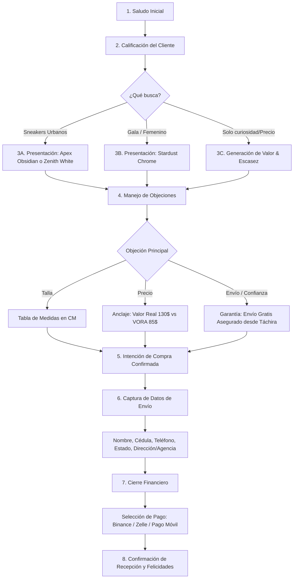

# VORA Elite: Flujo Lógico de Cierre de Ventas (WhatsApp)

Este diagrama representa los estados por los que el *VORA Concierge* debe guiar al cliente hasta convertir la venta.

## Leyenda de Fases para el LLM (Gestión de Estado)
1. **Saludo:** Establecer marco de autoridad y elegancia.
2. **Calificación:** Preguntar sutilmente si busca calzado para diario, evento especial, etc.
3. **Presentación:** Enviar imágenes del catálogo ganador en `/inventory` y soltar el Copy SEO adaptado.
4. **Objeciones:** Aplicar directivas del System Prompt relativas a tallas y confianza.
5. **Cierre:** Hacer la pregunta afirmativa ("¿A qué nombre reservamos su par exclusivo?").
6. **Datos:** Solicitar formato estándar de envíos en Venezuela (MRW/Zoom/Tealca).
7. **Finanzas:** Proveer los datos bancarios exactos solo cuando los datos de envío estén completos.
